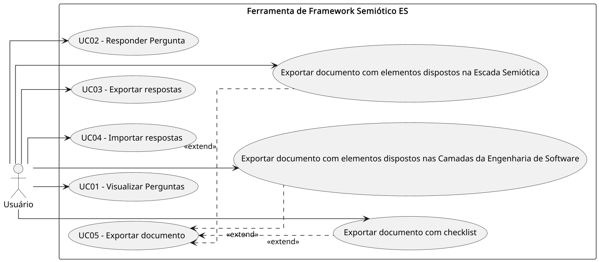

## 1. Introdução

### 1.1 Propósito

Este documento tem como objetivo descrever os requisitos da ferramenta fs.SwEdu: Um Framework Semioparticipativo para o Desenvolvimento de Software em Domínio Educacional. Baseada na Escada Semiótica (LIU, 2000), ou *framework* semiótico (do inglês, *semiotic framework*), e nas Camadas da Engenharia de Software propostas por Pressman e Maxim (2016), a ferramenta visa auxiliar no ensino e na prática da Engenharia de Software por meio da modelagem, visualização e documentação de elementos semióticos.

### 1.2 Escopo

A ferramenta será uma aplicação *web* que funcionará totalmente no navegador, sem necessidade de *backend* discreto. Permitirá o gerenciamento de elementos semióticos, visualizações gráficas, importação/exportação de arquivos XML, além da geração de relatórios e *checklist* em PDF. O projeto será distribuído como um Recurso Educacional Aberto (REA), incentivando o uso e adaptação por parte da comunidade.

### 1.3 Definições, Acrônimos e Abreviações

* **ERS**: Especificação de Requisitos de Software  
* **XML**: Extensible Markup Language  
* **PDF**: Portable Document Format  
* **REA**: Recurso Educacional Aberto  
* **UI**: Interface de Usuário

### 1.4 Referências

LIU, K. **Semiotics in Information Systems Engineering.** Cambridge, England: Cambridge University Press, 2000\.  

PRESSMAN, R. S.; MAXIM, B. R. **Engenharia de software.** 8\. ed. Porto Alegre: AMGH, 2016\.

### 1.5 Visão Geral

Este documento detalha os requisitos funcionais e não funcionais da ferramenta, descrevendo suas funcionalidades, interfaces e restrições.

## 2. Descrição Geral

### 2.1 Perspectiva do Produto

O produto será uma aplicação *web standalone*, utilizando tecnologias *client-side* (HTML, CSS, JavaScript) com uma interface gráfica componentizada. Não dependerá, portanto, de servidores externos para operar.

### 2.2 Funções do Produto

* Gerenciar elementos da Escada Semiótica e das Camadas de Engenharia de Software;  
* Importar e exportar elementos em XML;  
* Visualizar dados em formatos gráficos;  
* Gerar relatórios e *checklist* em PDF.

### 2.3 Características dos Usuários

Usuários esperados incluem estudantes, professores e profissionais de Engenharia de Software, com conhecimento básico de Informática.

### 2.4 Restrições

* Executar exclusivamente no lado cliente (navegador);  
* Exportação e importação devem seguir formatos padronizados e extensíveis;  
* Interface deve ser componentizada para manutenção facilitada.

### 2.5 Suposições e Dependências

* Navegador moderno com suporte a JavaScript;  
* Biblioteca de terceiros para geração de PDF (ex: jsPDF);  
* Parser XML disponível em JavaScript.

## 3. Funcionalidades do Sistema

### 3.1 Gerenciamento de Perguntas

**Descrição:** Funcionalidade para visualizar e responder perguntas via UI.  
**Entradas:** Arquivos XML, respostas às perguntas.  
**Saídas:** Confirmação de ações e exibição atualizada das perguntas e respectivas respostas.

### 3.2 Importação e Exportação de Arquivos

**Descrição:** Permite importar e exportar dados em XML, além de exportar relatórios e *checklist*.  
**Entradas:** Arquivos XML, solicitação de exportação.  
**Saídas:** Dados carregados, arquivos gerados.

### 3.3 Geração de Relatórios e *Checklist*

**Descrição:** Criação de documentos contendo informações do projeto e listas de verificação de conformidade.  
**Entradas:** Respostas atribuídas às questões.  
**Saídas:** Relatório, *checklist*.

## 4. Requisitos de Interfaces Externas

### 4.2 Interfaces de Hardware

* Não aplicável (executa somente em navegador *web*)

### 4.3 Interfaces de Software

* *Parser* e gerador XML (JavaScript);  
* Biblioteca de geração de PDF (ex: jsPDF).

### 4.4 Interfaces de Comunicação

* Não aplicável (sem *backend* ou comunicação em rede)

## 5. Requisitos do Sistema

### 5.1 Requisitos Funcionais

| Código | Requisito Funcional                                                                     | Prioridade |
|--------|-----------------------------------------------------------------------------------------|------------|
| RF01   | Visualização de perguntas.                                                              | Alta       |
| RF02   | Respostas a perguntas.                                                                  | Alta       |
| RF03   | Agrupar perguntas por classificação, conforme especificado em arquivo XML.              | Alta       |
| RF04   | Importar elementos a partir de arquivos XML válidos.                                    | Alta       |
| RF05   | Exportar as respostas atuais para um arquivo XML.                                       | Alta       |
| RF06   | Exportar um documento com os elementos dispostos na Escada Semiótica.                   | Média      |
| RF07   | Exportar um *checklist* de conformidade.                                                | Média      |
| RF08   | Exportar um documento com os elementos dispostos nas Camadas de Engenharia de Software. | Alta       |

### 5.2 Requisitos de Segurança

* Os dados devem ser mantidos localmente no navegador (ex: LocalStorage).

### 5.3 Atributos de Qualidade

* **Usabilidade:** Interface clara, intuitiva, responsiva e fácil de utilizar.  
* **Portabilidade:** Compatível com navegadores modernos (Chrome, Firefox, Edge).  
* **Manutenibilidade:** Estrutura de código modular e componentizada.

### 5.4 Requisitos Não Funcionais

| Código | Requisito Não Funcional                                                                                        | Prioridade |
|--------|----------------------------------------------------------------------------------------------------------------|------------|
| RNF01  | O sistema deve garantir a integridade dos dados durante importação, exportação e armazenamento local.          | Alta       |
| RNF02  | Os dados do usuário não devem ser transmitidos para servidores externos; todo processamento ocorre localmente. | Alta       |
| RNF03  | O sistema deve funcionar em diferentes sistemas operacionais via navegador moderno.                            | Alta       |
| RNF04  | Exportar arquivos em formato PDF.                                                                              | Alta       |

## 6. Outros Requisitos Não Funcionais

### 6.1 Conformidade Legal e Regulatória

* Licenciamento como Recurso Educacional Aberto (REA)

### 5.2 Regras de Negócio

* Exportações devem seguir a estrutura XML acordada.

## 7. Diagrama de Casos de Uso

A seguir, apresenta-se o diagrama de casos de uso da ferramenta, ilustrando as principais interações do usuário com o sistema:  

{ width=100% }

### Apêndice A: Glossário

* **Elementos:** Perguntas, Tags e Respostas.  
* **Checklist:** Documento com itens de verificação para conformidade de projeto.  
* **Escada Semiótica:** Modelo teórico que categoriza níveis de representação de conhecimento.  
* **Camadas de Engenharia de Software:** Modelo baseado em qualidade, processo, métodos e ferramentas.

### Apêndice B: Referências

* “Engenharia de Software” de Pressman e Maxim

### Apêndice C: Índice

(Não aplicável)
